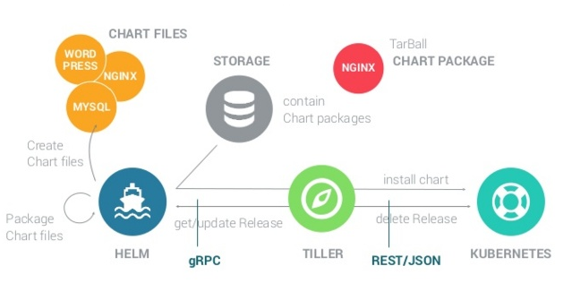

[Helm](https://github.com/helm/helm) is a [Cloud Native Foundation](https://www.cncf.io/) project to define, install and manage applications in Kubernetes.


### tl;dr

Helm is a Package Manager for Kubernetes

* package multiple K8s resources into a single logical deployment unit
* ... but it's not just a Package Manager

Helm is a Deployment Management for Kubernetes

* do a repeatable deployment
* manage dependencies: reuse and share
* manage multiple configurations
* update, rollback and test application deployments

As a recap for after the labs, you can watch *[Amy Chen](https://twitter.com/TheAmyCode)* and her talk at Kubecon North America in 2017.



### Prerequisites

* We assume you have knowledge about Kubernetes and understand the concepts behind [Pods](https://kubernetes.io/docs/concepts/workloads/pods/pod/), [Deployments](https://kubernetes.io/docs/concepts/workloads/controllers/deployment/), [Services](https://kubernetes.io/docs/concepts/services-networking/service/), [Ingress](https://kubernetes.io/docs/concepts/services-networking/ingress/) and [Secrets](https://kubernetes.io/docs/concepts/services-networking/service/)
* You should also have `kubectl` installed and a working context to access a Kubernetes cluster. Check the [kubectl Cheat Sheet](https://kubernetes.io/docs/reference/kubectl/cheatsheet/) for the most common commands.
* Make sure you have access to the internet from your shell. If required, set appropriate proxy settings in your shell. This is only needed for lab 3.0 to access the Helm hub.


### Helm Overview

Ok, let's start with Helm.
First, you have to understand the following 3 Helm concepts: **Chart**, **Repository** and **Release**.

A **Chart** is a Helm package. It contains all of the resource definitions necessary to run an application, tool, or service inside of a Kubernetes cluster. Think of it like the Kubernetes equivalent of a Homebrew formula, an Apt dpkg, or a Yum RPM file.

A **Repository** is the place where charts can be collected and shared. It’s like Perl’s CPAN archive or the Fedora Package Database, but for Kubernetes packages.

A **Release** is an instance of a chart running in a Kubernetes cluster. One chart can often be installed many times into the same cluster. And each time it is installed, a new release is created. Consider a MySQL chart. If you want two databases running in your cluster, you can install that chart twice. Each one will have its own release, which will in turn have its own release name.

With these concepts in mind, we can now explain Helm like this:

> Helm installs charts into Kubernetes, creating a new release for each installation. And to find new charts, you can search Helm chart repositories.


*[Image Source](https://www.slideshare.net/alexLM/helm-application-deployment-management-for-kubernetes)*


### Task: Training Setup

Make sure you have access to the Mobiliar `dev` Kubernetes cluster and `kubectl` is configured to use the right context.


For the following labs we are going to create a namespace. You can choose any name, we suggest using e.g. your username.

You can create your namespace with:



We already created a namespace for you. The name of your namespace is equal to your Mobi U-Account `u....` and has been placed in the Project `helm`.
Just to see it again, a namespace in Kubernetes can be created with:



```bash
kubectl create namespace <namespace>
```

In the labs we are going to use `<namespace>` as a placeholder for your namespace.

{}
Each time you see a `<namespace>` somewhere in a command, replace it with your chosen namespace name.
{}
