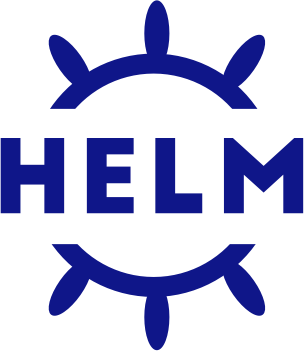

[Helm](https://github.com/helm/helm) is a [Cloud Native Foundation](https://www.cncf.io/) project to define, install and manage applications in Kubernetes.




### Lab Conventions

In order for you to know what is command line input and what is output, we use the following conventions:

Command line input is prefixed by a dollar sign (`$`), e.g.:

```
$ helm version
```

Whereas output is appended directly beneath the command that is supposed to generate it, e.g.:

```
$ helm version
Client: &version.Version{SemVer:"v2.16.5", GitCommit:"89bd14c1541fa93a09492010030fd3699ca65a97", GitTreeState:"clean"}
```


### Prerequisites

* We assume you have knowlege about Kubernetes and understand the concepts behind [Pods](https://kubernetes.io/docs/concepts/workloads/pods/pod/), [Deployments](https://kubernetes.io/docs/concepts/workloads/controllers/deployment/), [Services](https://kubernetes.io/docs/concepts/services-networking/service/), [Ingress](https://kubernetes.io/docs/concepts/services-networking/ingress/) and [Secrets](https://kubernetes.io/docs/concepts/services-networking/service/)
* You also should have `kubectl` installed and a working context to access a Kubernetes Cluster


### Helm Overview

Ok, let's start with Helm. 
First, you have to understand the following 3 Helm concepts: **Chart**, **Repository** and **Release**.

A **Chart** is a Helm package. It contains all of the resource definitions necessary to run an application, tool, or service inside of a Kubernetes cluster. Think of it like the Kubernetes equivalent of a Homebrew formula, an Apt dpkg, or a Yum RPM file.

A **Repository** is the place where charts can be collected and shared. It’s like Perl’s CPAN archive or the Fedora Package Database, but for Kubernetes packages.

A **Release** is an instance of a chart running in a Kubernetes cluster. One chart can often be installed many times into the same cluster. And each time it is installed, a new release is created. Consider a MySQL chart. If you want two databases running in your cluster, you can install that chart twice. Each one will have its own release, which will in turn have its own release name.

With these concepts in mind, we can now explain Helm like this:

Helm installs charts into Kubernetes, creating a new release for each installation. And to find new charts, you can search Helm chart repositories.


### Task: Techlab Setup

Make sure you have access to a Kubernetes cluster and `kubectl` is configured to use the right context. For the following labs we are going to create a namespace. You can choose any name, we suggest using e.g. your username. In the labs we are going to use `[USER]` as a placeholder for your created namespace.

```bash
$ kubectl create ns [USER]
``` 

{}

**Die Mobiliar** Create the namespace with your Mobiliar Rancher WebGUI inside a Feature Team on your dev cluster.

{}
